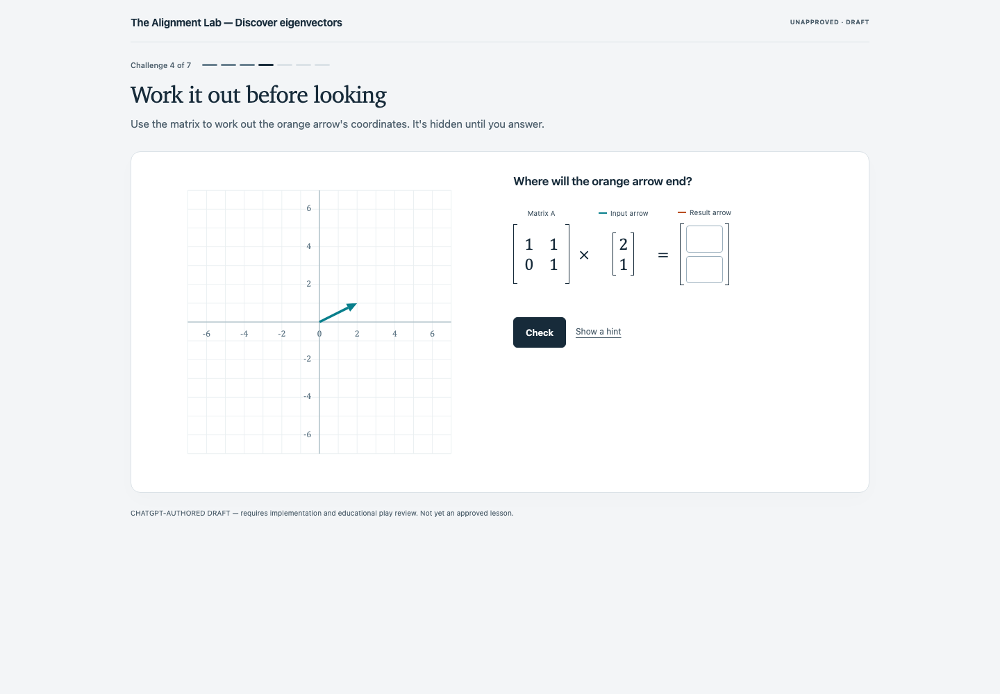
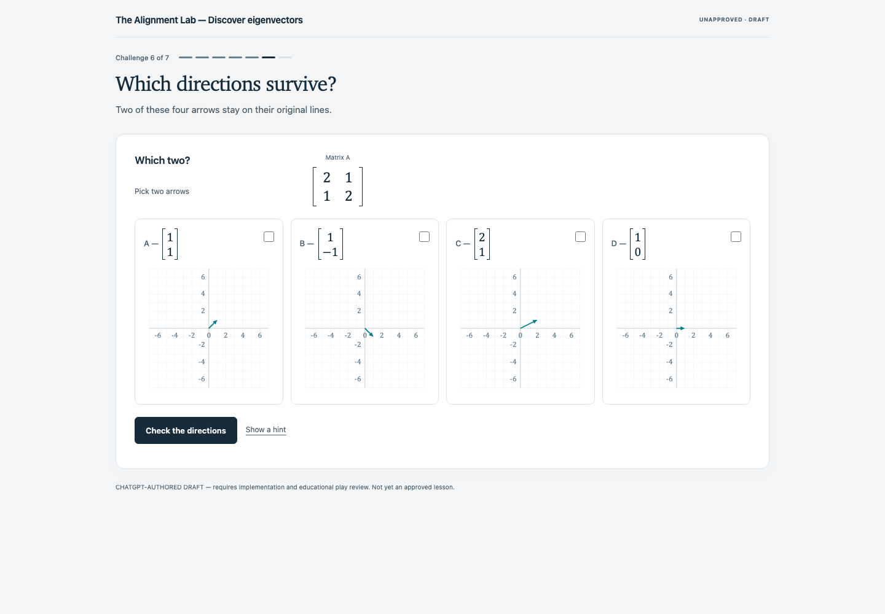
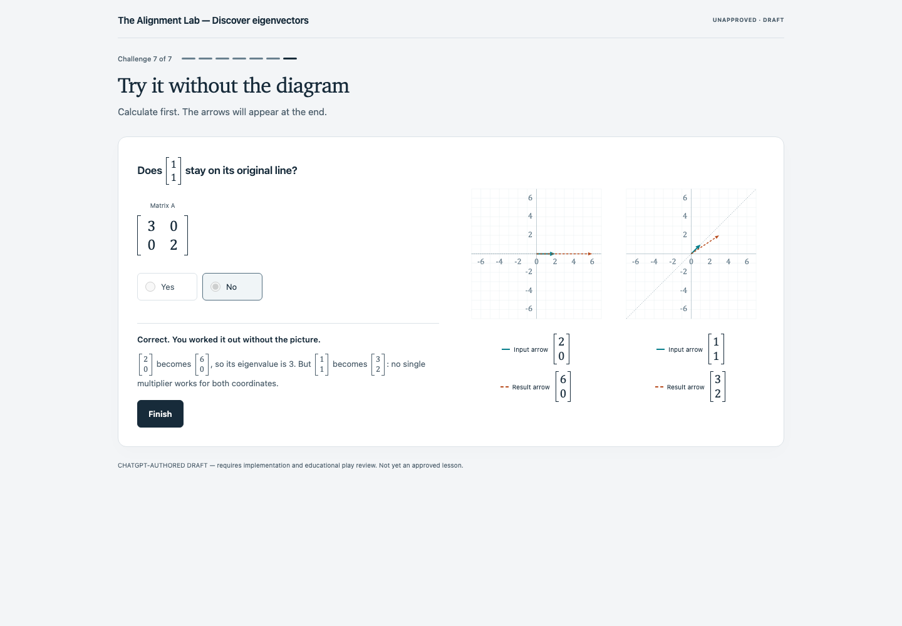

# Alignment Lab — sequential challenges and final UI redesign

Chris rejected the earlier UI as cluttered, oversized and harder to follow than paper. He authorized this final autonomous UI/UX pass and ended the back-and-forth authoring loop. **Earlier screenshots and visual endorsements are superseded.** The new interface uses a compact mathematical worksheet, column-vector entry, directly selectable candidate diagrams, and one current task at a time.

[Play the latest build](https://novakai-one.github.io/ai-authored-educational-experiences/previews/eigenvector-alignment-lab/?experience=eigenvector-alignment-lab). [PR #3](https://github.com/novakai-one/ai-authored-educational-experiences/pull/3) records the exact implementation SHA, fixed preview URL, deployment run and live verification. The PR targets `authoring/eigenvector-alignment-lab`; nothing was merged into `main`. The authored draft status remains unchanged.

## Frozen source

- Authoring commit: `24d7375f5123fd77c2e4a24a707bbf1c5d7497d7`.
- The implementation branch was rebased from the superseded `0beb0d8…` baseline onto this authoring commit.
- Spec: `public/experiences/eigenvector-alignment-lab.json`.
- Spec SHA-256: `58d8443f72ccc5c25a66718442e4049e1890e5b36e702aaa545e7208c2147281`.
- Brief SHA-256: `e3b37799233c8aa5f8a7fed0582ed8d4199575f4fb789f77f13aab306940257d`.
- `public/experiences/**` and `authoring/**` remain byte-identical to that commit. No wording, values, answers, approval records or author review decisions were edited.

## What changed

1. **The calculation is one expression.** Matrix × input = result appears together. Coordinate fields occupy the two entries of a column vector, rather than stretching across the page. Scalar fields are 72px wide; coordinate fields are 38–53px wide depending on viewport.
2. **One shared workspace replaces separate console cards.** The active question, calculation and action stay close together. The draft notice moved below the activity; the header still shows draft status. Typography separates prose from conventional mathematical notation.
3. **Choose the diagram itself.** Stage 6 has four directly selectable candidate panels, without a duplicate checkbox list elsewhere. In phase 2, A/B multiplier fields sit beneath their own diagrams. C/D have no answer controls and never reveal transformed arrows.
4. **Complex challenges are sequential.** Stage 5 has line/scale phases, stage 6 has selection/multiplier phases, and stage 7 has output/multiplier/classification phases. Future prompts and controls are absent from the DOM. Correct intermediate answers lock and wait for the authored Continue button. Previous controls/feedback clear on continuation; focus moves to the next question.
5. **Hints and results have explicit boundaries.** Stages 4, 6 and 7 offer hints immediately. Hints close after a correct phase but remain recorded in that phase's metrics. Output diagrams and numerical readouts stay hidden until permitted. Stage 7 shows only the authored earned-result recap in phase 2, then reveals both diagrams after full success.
6. **Typing and continuation work naturally.** The hunt accepts transient empty/sign drafts so negative numbers can be typed normally. Only valid integer grid coordinates update the diagram; blur normalizes to the authored range. An incomplete draft cannot be submitted. Feedback and the next action scroll into view when needed. The final desktop reveal keeps the answer column in place.

Every existing numerical vector expression still renders vertically with square brackets, including prose, choices, feedback, captions and readouts. Original expression characters and accessible math names are preserved. The existing symbolic expression `A v = λ v` receives mathematical typography without changing its text. New ×, = and ? notation organizes the already-authored computation; no teaching sentences were added.

## Verification

Final local `npm run check` passed: schema regeneration check, both source validations, copy guard, TypeScript, production build, **75 unit tests and 20 headless Chromium browser tests**. This includes all seven original-demo browser tests. `BASE_REF=24d7375f5123fd77c2e4a24a707bbf1c5d7497d7 npm run guard:diff` passes; the protected-file diff is empty.

Coverage includes all authored feedback branches; independent matrix results; signed-decimal parsing; invalid input; zero-vector rejection; all 49 hunt grid points; actual snapped pointer drag and keyboard movement; ordinary negative-number typing; clicking a diagram to select it; correct phase order and locking; absence of future prompts/fields; no premature SVG/readout/description reveal; earned recap timing; per-phase attempts/hints; full restart; and visible failure on invalid specifications.

Browser layout checks cover 320, 390, 740, 800 and 1280px; screenshot evidence uses desktop 1440×1000 and mobile 390×844. Coordinate fields remain vertically stacked and number-sized. There is no horizontal overflow. Axe reported no violations in the checked initial, intermediate and final states. 650ms reveals end at the independently computed coordinates; reduced motion reveals immediately. Intermediate and final continuation buttons are verified in the viewport after feedback. These checks do not establish learner understanding or replace manual assistive-technology testing.

The copy guard additionally permits conditional technical `data-*` identifiers, consistent with its existing literal/template handling. Prose and accessible labels are still checked; regression tests reject unauthored conditional teaching. Strict config/copy schemas require every revised phase key and reject missing, unknown, reordered or contradictory data.

## Whole-output review: concrete findings and repairs

- The original side-by-side coordinate boxes separated a vector into two wide form fields. The new screenshots show both coordinates in the correct vertical order inside one pair of brackets, adjacent to the matrix. Browser geometry checks verify that placement across five widths.
- Stage 6 previously repeated candidates in diagrams and a separate control list. The new initial screenshot has four clickable diagrams; the multiplier screenshot associates each field directly with A or B. Clicking the plotted area, not just the checkbox, was exercised.
- Intermediate success used to leave hints competing with feedback. The final stage 5 mobile screenshot shows only the locked Yes/No decision, success text and Continue. The multiplier question is not present yet.
- A blank or minus sign in the hunt's old numeric control was rejected too early. A browser test now clears x, types `-2` naturally, sets y to zero, and successfully commits the corresponding nonzero direction.
- The final desktop reveal originally moved the answer column to make room for diagrams. The final screenshot keeps the decision/feedback on the left and introduces the two diagrams on the right. On mobile, automatic feedback scrolling keeps Finish reachable.
- A scaled contact-sheet thumbnail made the hunt's completed coordinate difficult to read. Inspection of the actual full-size PNG confirmed input/output (2,0), coincident arrows on the horizontal line, and the authored success explanation. Contact sheets were used for composition, with full-resolution inspection for mathematical details.
- The first screenshots still duplicated source readouts beneath every candidate. These are now removed where the candidate caption already supplies the vector; A/B regain source/result readouts on reveal. The source/result encodings remain solid/dashed teal/orange, with matching semantic swatches.
- A final live walkthrough exposed undersized candidate-vector captions and tick labels sitting against the axes. Candidate vectors now use 20px type on desktop and 18px on mobile. Tick labels align by their actual baseline and have a white outline separating them from grid lines; the coordinate domain, tick values and arrow geometry are unchanged.
- Parallel screenshot capture exposed two test timing assumptions: the fourteen-scan mobile accessibility journey could exceed the default 30 seconds, and a wall-clock animation read could arrive after the reveal ended. That journey now has a 60-second budget. The animation test controls the browser clock and checks the start, partial movement, still-incomplete position at 640ms, and exact endpoint after the next animation frame; its assertions cover both an existing diagram and the final newly mounted diagram.

One inherited source inconsistency remains documented without rewriting education: `steps[4].copy.a11yChoices` says the hint is available after an incorrect attempt, while `steps[4].config.offerHintAfterAttempts` is 0 and the revised brief explicitly requires immediate access. The implementation follows the configured immediate hint threshold and preserves the authored text. For phased stages, the exact current authored question supplies phase-specific assistive instructions instead of mounting a future-task overview. No additional ChatGPT round is requested by this implementation.

## Screenshot evidence

The folder contains **94 actual rendered PNGs**: briefing/completion plus initial, wrong-answer, hint, intermediate-success and final states for every applicable phase, on desktop and mobile. The manifest files record the exact question, feedback, hint and computed result coordinates for each challenge capture. Captures wait for final arrow endpoints and fail on browser errors or horizontal overflow. These are real browser renders, not mockups.

[Browse the image folder](screenshots) or download this directory and open [the filterable gallery](gallery.html). Selected states:







| Stage and phase | Desktop initial | Wrong answer | Hint | Success | Mobile initial | Mobile success |
| --- | --- | --- | --- | --- | --- | --- |
| 1: predict-output | [Initial](screenshots/desktop-01-predict-output-initial.png) | [Wrong](screenshots/desktop-01-predict-output-wrong.png) | [Hint](screenshots/desktop-01-predict-output-hint.png) | [Success](screenshots/desktop-01-predict-output-final.png) | [Initial](screenshots/mobile-01-predict-output-initial.png) | [Success](screenshots/mobile-01-predict-output-final.png) |
| 2: classify-line | [Initial](screenshots/desktop-02-classify-line-initial.png) | [Wrong](screenshots/desktop-02-classify-line-wrong.png) | [Hint](screenshots/desktop-02-classify-line-hint.png) | [Success](screenshots/desktop-02-classify-line-final.png) | [Initial](screenshots/mobile-02-classify-line-initial.png) | [Success](screenshots/mobile-02-classify-line-final.png) |
| 3: hunt-direction | [Initial](screenshots/desktop-03-hunt-direction-initial.png) | [Wrong](screenshots/desktop-03-hunt-direction-wrong.png) | [Hint](screenshots/desktop-03-hunt-direction-hint.png) | [Success](screenshots/desktop-03-hunt-direction-final.png) | [Initial](screenshots/mobile-03-hunt-direction-initial.png) | [Success](screenshots/mobile-03-hunt-direction-final.png) |
| 4: calculate-output | [Initial](screenshots/desktop-04-calculate-output-initial.png) | [Wrong](screenshots/desktop-04-calculate-output-wrong.png) | [Hint](screenshots/desktop-04-calculate-output-hint.png) | [Success](screenshots/desktop-04-calculate-output-final.png) | [Initial](screenshots/mobile-04-calculate-output-initial.png) | [Success](screenshots/mobile-04-calculate-output-final.png) |
| 5: same-line | [Initial](screenshots/desktop-05-same-line-initial.png) | [Wrong](screenshots/desktop-05-same-line-wrong.png) | [Hint](screenshots/desktop-05-same-line-hint.png) | [Success](screenshots/desktop-05-same-line-intermediate.png) | [Initial](screenshots/mobile-05-same-line-initial.png) | [Success](screenshots/mobile-05-same-line-intermediate.png) |
| 5: scale | [Initial](screenshots/desktop-05-scale-initial.png) | [Wrong](screenshots/desktop-05-scale-wrong.png) | [Hint](screenshots/desktop-05-scale-hint.png) | [Success](screenshots/desktop-05-scale-final.png) | [Initial](screenshots/mobile-05-scale-initial.png) | [Success](screenshots/mobile-05-scale-final.png) |
| 6: choose-directions | [Initial](screenshots/desktop-06-choose-directions-initial.png) | [Wrong](screenshots/desktop-06-choose-directions-wrong.png) | [Hint](screenshots/desktop-06-choose-directions-hint.png) | [Success](screenshots/desktop-06-choose-directions-intermediate.png) | [Initial](screenshots/mobile-06-choose-directions-initial.png) | [Success](screenshots/mobile-06-choose-directions-intermediate.png) |
| 6: enter-multipliers | [Initial](screenshots/desktop-06-enter-multipliers-initial.png) | [Wrong](screenshots/desktop-06-enter-multipliers-wrong.png) | [Hint](screenshots/desktop-06-enter-multipliers-hint.png) | [Success](screenshots/desktop-06-enter-multipliers-final.png) | [Initial](screenshots/mobile-06-enter-multipliers-initial.png) | [Success](screenshots/mobile-06-enter-multipliers-final.png) |
| 7: calculate-output | [Initial](screenshots/desktop-07-calculate-output-initial.png) | [Wrong](screenshots/desktop-07-calculate-output-wrong.png) | [Hint](screenshots/desktop-07-calculate-output-hint.png) | [Success](screenshots/desktop-07-calculate-output-intermediate.png) | [Initial](screenshots/mobile-07-calculate-output-initial.png) | [Success](screenshots/mobile-07-calculate-output-intermediate.png) |
| 7: find-eigenvalue | [Initial](screenshots/desktop-07-find-eigenvalue-initial.png) | [Wrong](screenshots/desktop-07-find-eigenvalue-wrong.png) | [Hint](screenshots/desktop-07-find-eigenvalue-hint.png) | [Success](screenshots/desktop-07-find-eigenvalue-intermediate.png) | [Initial](screenshots/mobile-07-find-eigenvalue-initial.png) | [Success](screenshots/mobile-07-find-eigenvalue-intermediate.png) |
| 7: classify-vector | [Initial](screenshots/desktop-07-classify-vector-initial.png) | [Wrong](screenshots/desktop-07-classify-vector-wrong.png) | [Hint](screenshots/desktop-07-classify-vector-hint.png) | [Success](screenshots/desktop-07-classify-vector-final.png) | [Initial](screenshots/mobile-07-classify-vector-initial.png) | [Success](screenshots/mobile-07-classify-vector-final.png) |

## Reproduce and preview identity

```sh
npm ci
npm run check
BASE_REF=24d7375f5123fd77c2e4a24a707bbf1c5d7497d7 npm run guard:diff
EVIDENCE_DIR=docs/evidence/eigenvector-alignment-lab/screenshots npm run test:e2e -- tests/eigen-evidence.spec.ts
```

The review workflow records `review-build.json` with implementation SHA, frozen authoring SHA and spec hash. It publishes `/previews/eigenvector-alignment-lab/<full implementation SHA>/?experience=eigenvector-alignment-lab` and a latest-build alias. It carries forward earlier versioned previews, checks snapshot integrity, refuses to overwrite a SHA with different bytes, and fails rather than silently discard unreachable history. A regression verifies preservation of old URLs, alias replacement and an unchanged main root. The workflow also uploads a downloadable build artifact for 90 days. A separate root-only Pages publication can still replace the whole deployment; the Git commit and build artifact remain the reproducible reference.

For local use, `npm run preview` serves `dist/`; open `http://localhost:4173/?experience=eigenvector-alignment-lab`. A downloaded static build must be served over HTTP, not opened with `file://`.
